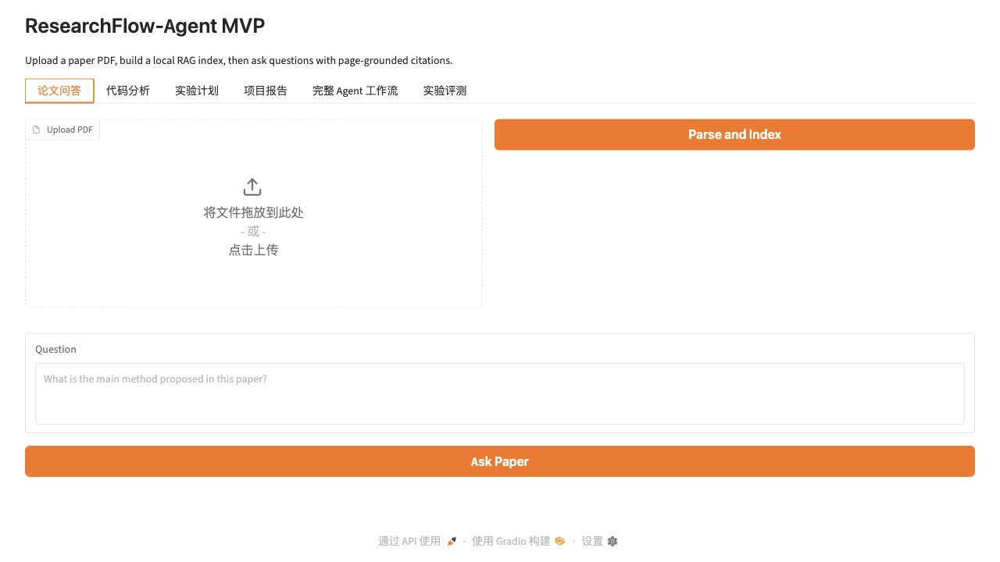
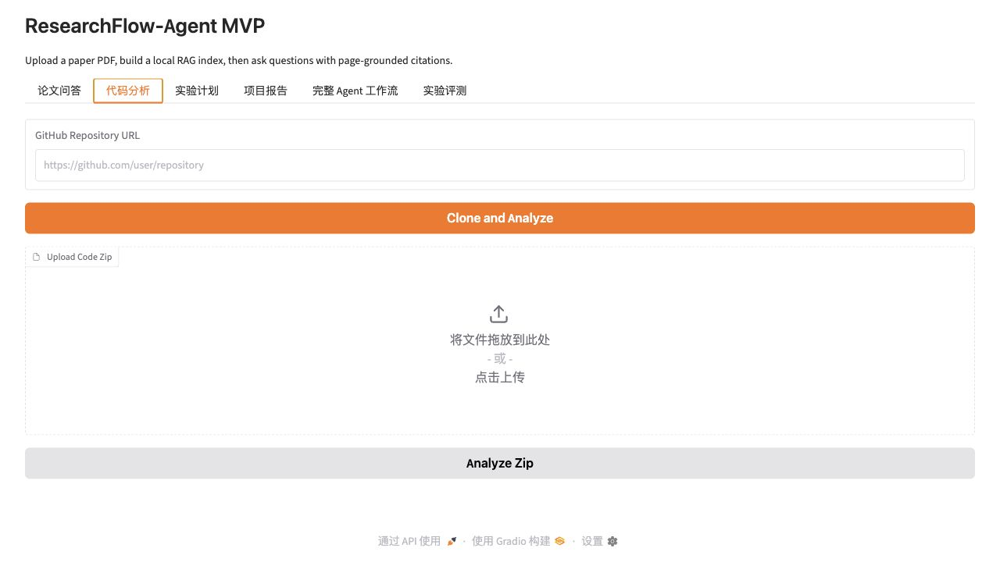
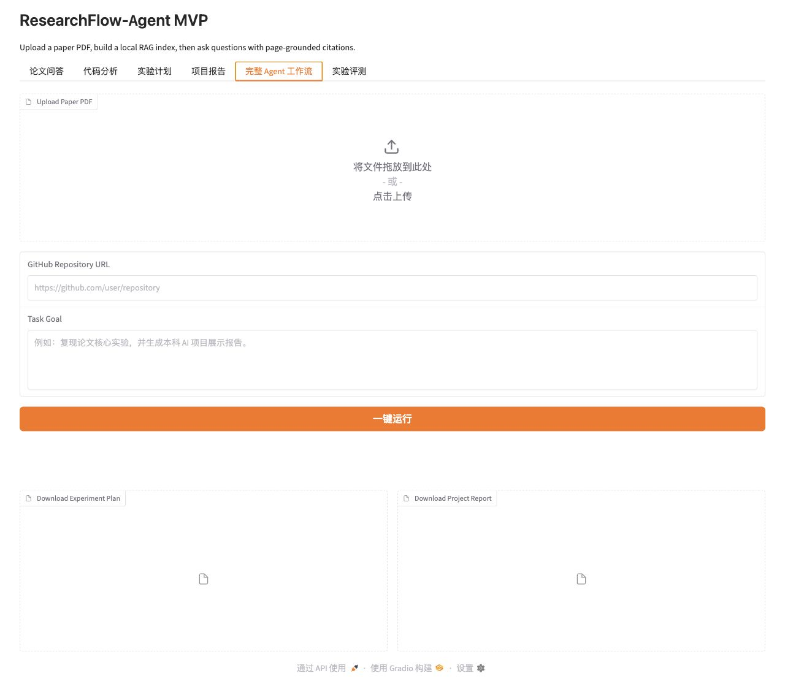
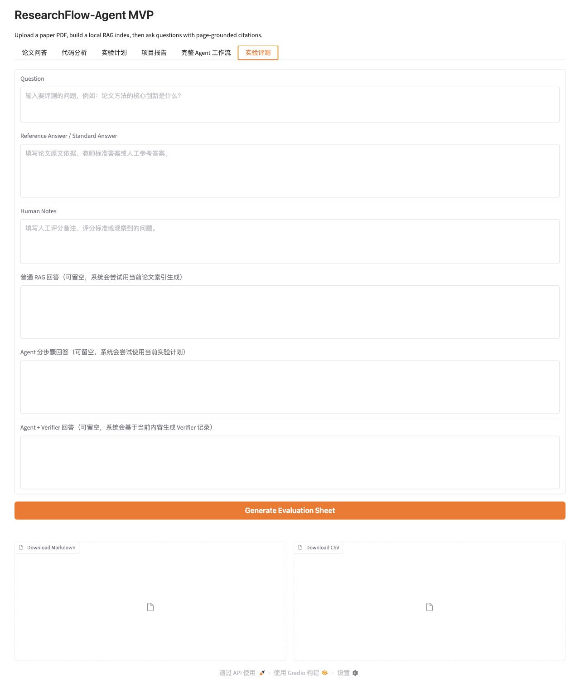
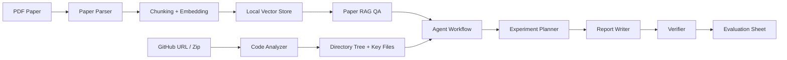

# ResearchFlow-Agent

**基于多工具调用的科研论文阅读与实验复现 AI Agent 系统**  
**A multi-tool AI Agent system for research paper reading, repository analysis, experiment reproduction planning, and evidence-aware reporting**

ResearchFlow-Agent 面向大学生科研训练、课程项目、科研入门和 AI 项目经历展示。系统支持上传论文 PDF、构建论文 RAG 知识库、分析 GitHub 代码仓库、生成实验复现计划、生成 Markdown 项目报告，并通过 Verifier 标注证据来源与不确定性。

ResearchFlow-Agent is designed for undergraduate research training, AI course projects, early-stage research practice, and portfolio-ready project demonstrations. It supports PDF paper ingestion, paper-grounded RAG, GitHub repository analysis, experiment reproduction planning, Markdown report generation, and evidence-aware verification.



## 项目定位 / Project Positioning

ResearchFlow-Agent 不是普通聊天机器人，而是一个围绕“论文 + 代码 + 复现实验”的科研工作流 Agent。它强调可解释过程、可追溯证据、可保存输出和人工可复核的评测记录。

ResearchFlow-Agent is not a generic chatbot. It is a research workflow agent centered on "paper + code + reproducible experiment". It emphasizes inspectable steps, traceable evidence, saved artifacts, and human-reviewable evaluation records.

适用场景：

- 本科生人工智能项目经历展示
- 科研论文阅读与方法梳理
- 开源论文代码仓库结构分析
- 实验复现计划设计
- Markdown 项目报告生成
- RAG / Agent / Verifier 模式对比评测

Use cases:

- Undergraduate AI portfolio projects
- Research paper reading and method understanding
- Open-source research repository analysis
- Experiment reproduction planning
- Markdown project report generation
- Evaluation of RAG, Agent, and Agent + Verifier workflows

## 核心功能 / Core Features

| 模块 | 中文说明 | English Description |
| --- | --- | --- |
| Paper RAG | 解析 PDF、保留页码、切分 chunk、生成 embedding、检索论文证据并回答问题 | Parse PDFs, preserve page numbers, chunk text, embed content, retrieve evidence, and answer paper questions |
| Code Analyzer | 支持 GitHub clone 和 zip 上传，生成目录树，识别 README、依赖文件、训练/推理/模型/数据集/config 文件 | Clone GitHub repositories or extract zip archives, generate a directory tree, and detect key files |
| Experiment Planner | 基于论文和代码分析结果生成实验目标、环境配置、数据准备、训练测试步骤和风险提示 | Generate experiment goals, environment setup, data preparation, training/testing steps, and reproduction risks |
| Report Writer | 生成包含背景、相关工作、方法、系统设计、实验步骤和结果模板的 Markdown 报告 | Generate Markdown reports with background, related work, methods, system design, experiments, and result templates |
| Agent Workflow | 一键执行论文解析、RAG 构建、论文摘要、代码分析、计划生成、报告生成和 Verifier 检查 | Run the full pipeline with one click: paper parsing, RAG indexing, summary, code analysis, planning, reporting, and verification |
| Verifier | 区分论文证据、代码证据、模型推断、缺少证据、人工确认项和潜在幻觉 | Separate paper evidence, code evidence, model inference, missing evidence, human-review items, and possible hallucinations |
| Evaluation | 生成普通 RAG、Agent 分步骤、Agent + Verifier 三种模式的人工评分表 | Generate manual evaluation sheets for ordinary RAG, step-by-step Agent, and Agent + Verifier outputs |

## 界面截图 / Screenshots

### 论文问答 / Paper QA

上传论文 PDF 后，系统会解析文本、保留页码、构建本地检索索引，并在回答中显示引用页码与原文片段。

After uploading a PDF, the system extracts text, preserves page numbers, builds a local retrieval index, and returns answers with page-grounded snippets.


### 代码分析 / Code Analysis

支持输入 GitHub 仓库链接或上传 zip 代码包，系统会生成目录树、识别关键文件，并给出代码结构总结。

The code analysis tab accepts a GitHub repository URL or a zip archive, generates a directory tree, detects key files, and summarizes the codebase.



### 完整 Agent 工作流 / Full Agent Workflow

完整工作流会从论文和 GitHub 仓库出发，一键生成论文摘要、代码分析、实验计划、项目报告和 Verifier 结果。

The full workflow starts from a paper PDF and a GitHub repository URL, then generates a paper summary, code analysis, experiment plan, project report, and verifier output.



### 实验评测 / Experiment Evaluation

实验评测模块用于比较普通 RAG、Agent 分步骤、Agent + Verifier 三种模式，输出 Markdown 和 CSV 人工评分表。

The evaluation module compares ordinary RAG, step-by-step Agent, and Agent + Verifier outputs, then exports Markdown and CSV manual scoring sheets.



## 系统架构 / System Architecture



系统采用模块化 Python 结构：论文解析、RAG、代码分析、Agent 编排、报告生成、Verifier 和 Evaluation 相互独立，便于测试和扩展。

The system uses a modular Python architecture. Paper parsing, RAG, code analysis, agent orchestration, report generation, verification, and evaluation are separated for testability and extensibility.

## 技术栈 / Tech Stack

- Python 3.10+
- Gradio
- PyMuPDF / pdfplumber
- sentence-transformers
- Local JSON vector store; Chroma / FAISS dependencies are included for extension
- OpenAI-compatible LLM API
- GitPython / subprocess
- Markdown and CSV artifact export
- pytest

## 目录结构 / Project Structure

```text
researchflow-agent/
  README.md
  AGENTS.md
  requirements.txt
  .env.example
  app.py
  config.py
  docs/
    images/
  data/
    uploads/
    vectorstores/
    workspaces/
    outputs/
  src/
    llm/
    paper/
    rag/
    code_analyzer/
    agent/
    report/
    evaluation/
    storage/
    utils/
  tests/
  examples/
```

关键目录说明：

- `src/paper`: PDF 解析与论文文本建模
- `src/rag`: chunk、embedding、本地向量检索和论文问答
- `src/code_analyzer`: GitHub / zip 代码加载、目录树和关键文件识别
- `src/agent`: 实验计划生成和完整 Agent Workflow
- `src/report`: Markdown 项目报告生成
- `src/evaluation`: Verifier 和三模式实验评测表
- `data/outputs`: 生成的计划、报告、评测表和工作流摘要
- `docs/images`: README 截图资源

Key directories:

- `src/paper`: PDF parsing and paper text models
- `src/rag`: chunking, embeddings, local retrieval, and paper QA
- `src/code_analyzer`: GitHub / zip code loading, directory tree generation, and key-file detection
- `src/agent`: experiment planning and complete Agent Workflow
- `src/report`: Markdown project report generation
- `src/evaluation`: verifier and three-mode evaluation sheets
- `data/outputs`: generated plans, reports, evaluation sheets, and workflow summaries
- `docs/images`: README screenshot assets

## 安装与运行 / Installation and Usage

建议使用独立 conda 环境，不要安装到 `base` 环境。

Use a dedicated conda environment instead of installing dependencies into `base`.

```bash
conda create -n researchflow python=3.11
conda activate researchflow
pip install -r requirements.txt
cp .env.example .env
python app.py
```

运行后打开终端输出中的本地 Gradio URL。

After starting the app, open the local Gradio URL printed in the terminal.

## 配置说明 / Configuration

复制 `.env.example` 为 `.env` 后可配置模型和运行参数。

Copy `.env.example` to `.env` and configure model/runtime settings.

```env
OPENAI_API_KEY=your_api_key_here
OPENAI_BASE_URL=https://api.openai.com/v1
OPENAI_MODEL=gpt-4o-mini
EMBEDDING_MODEL=sentence-transformers/all-MiniLM-L6-v2
ALLOW_HASH_EMBEDDING_FALLBACK=true
MAX_PAPER_CHUNK_TOKENS=220
CHUNK_OVERLAP_TOKENS=40
TOP_K_RETRIEVAL=5
```

如果没有配置 LLM API key，系统仍可运行离线模板和本地检索流程，但 LLM 总结质量会受限。

If no LLM API key is configured, the system can still run local retrieval and deterministic templates, but LLM-based summaries will be limited.

## 使用流程 / Workflows

### 1. 论文问答 / Paper QA

1. 打开 **论文问答** Tab。
2. 上传 PDF。
3. 点击 **Parse and Index**。
4. 输入问题并查看带页码引用的回答。

1. Open the **论文问答** tab.
2. Upload a PDF.
3. Click **Parse and Index**.
4. Ask a question and inspect page-grounded citations.

### 2. 代码分析 / Code Analysis

1. 打开 **代码分析** Tab。
2. 输入 GitHub 仓库链接，或上传 zip 代码包。
3. 查看目录树、关键文件表和代码结构总结。

1. Open the **代码分析** tab.
2. Enter a GitHub repository URL or upload a zip archive.
3. Review the directory tree, key files, and codebase summary.

### 3. 完整 Agent 工作流 / Full Agent Workflow

1. 打开 **完整 Agent 工作流** Tab。
2. 上传论文 PDF。
3. 输入 GitHub 仓库链接。
4. 输入任务目标。
5. 点击 **一键运行**。
6. 查看状态日志、论文摘要、实验计划、项目报告和 Verifier 输出。

1. Open the **完整 Agent 工作流** tab.
2. Upload a paper PDF.
3. Enter a GitHub repository URL.
4. Enter the task goal.
5. Click **一键运行**.
6. Review logs, paper summary, experiment plan, project report, and verifier output.

### 4. 实验评测 / Experiment Evaluation

实验评测用于比较三种模式：

1. 普通 RAG 回答
2. Agent 分步骤回答
3. Agent + Verifier 回答

The evaluation workflow compares three modes:

1. Ordinary RAG answer
2. Step-by-step Agent answer
3. Agent + Verifier answer

评测指标：

- 答案完整性
- 引用正确性
- 复现计划可执行性
- 是否存在无依据结论
- 人工评分备注

Evaluation metrics:

- Answer completeness
- Citation correctness
- Reproduction-plan executability
- Unsupported conclusions
- Human scoring notes

输出文件：

- `data/outputs/evaluation-*.md`
- `data/outputs/evaluation-*.csv`

Generated files:

- `data/outputs/evaluation-*.md`
- `data/outputs/evaluation-*.csv`

## Verifier 设计 / Verifier Design

Verifier 不声称生成内容 100% 正确。它的作用是帮助用户区分证据、推断和风险。

The verifier does not claim that generated content is 100% correct. Its purpose is to separate evidence, inference, and risk.

Verifier 输出七类信息：

1. 来自论文的内容
2. 来自代码仓库的内容
3. 模型推断的内容
4. 缺少证据的内容
5. 需要人工确认的内容
6. 可能存在幻觉的内容
7. 改进建议

The verifier outputs seven categories:

1. Content from the paper
2. Content from the code repository
3. Model-inferred content
4. Content with missing evidence
5. Items requiring human confirmation
6. Possible hallucinations
7. Improvement suggestions

## 测试 / Testing

```bash
conda activate researchflow
pytest tests
```

当前测试覆盖：

- PDF 解析错误处理
- chunk 切分
- embedding fallback 和本地向量检索
- 代码仓库分析
- 实验计划与报告生成
- 完整 Agent Workflow 成功与失败路径
- Verifier 证据归因与不确定性输出
- 实验评测表 Markdown / CSV 导出

Current tests cover:

- PDF parser error handling
- Chunking
- Embedding fallback and local vector retrieval
- Code repository analysis
- Experiment planning and report writing
- Full Agent Workflow success and failure paths
- Verifier evidence attribution and uncertainty reporting
- Evaluation Markdown / CSV export

## 当前状态 / Current Status

ResearchFlow-Agent 已实现一个完整可运行的科研训练 MVP：论文 RAG、代码分析、实验计划、报告生成、Verifier、实验评测和 Gradio UI 均已具备基础功能。

ResearchFlow-Agent currently provides a complete runnable research-training MVP: paper RAG, code analysis, experiment planning, report writing, verifier, evaluation sheets, and Gradio UI are implemented.

## 后续计划 / Roadmap

- SQLite 会话历史与项目级持久化
- 更严格的 citation-level fact checking
- 更完整的 Chroma / FAISS backend adapter
- 自动读取论文标题、作者、摘要和章节结构
- 评测结果可视化
- 示例论文与示例仓库 demo workflow

Planned improvements:

- SQLite session history and project-level persistence
- Stronger citation-level fact checking
- Complete Chroma / FAISS backend adapters
- Automatic paper title, author, abstract, and section extraction
- Evaluation result visualization
- Demo workflows with sample papers and repositories

## 声明 / Notes

本项目用于科研训练和项目展示辅助，不替代真实科研判断。论文事实、实验指标、复现结果和报告结论都应由使用者进行人工复核。

This project is intended to support research training and project presentation. It does not replace human research judgment. Paper facts, experiment metrics, reproduction results, and report conclusions should be manually verified.

