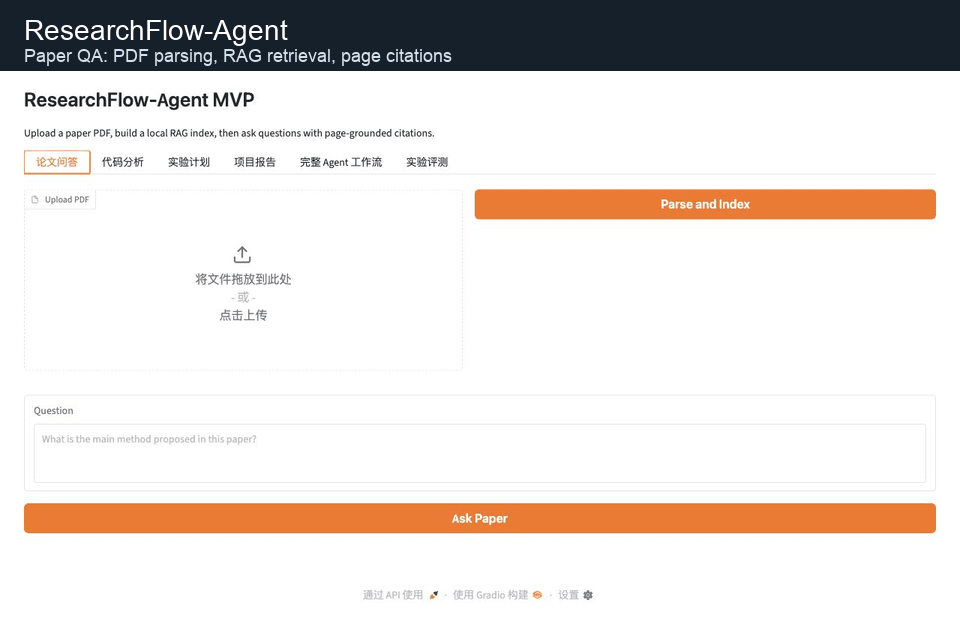
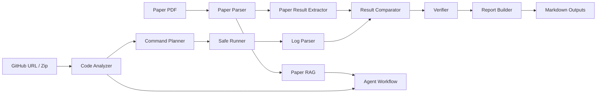

# ResearchFlow-Agent

**面向科研论文阅读、代码仓库分析、实验复现规划和证据核验的多工具 AI Agent 系统**
**A multi-tool AI Agent system for paper-grounded research workflows, repository analysis, experiment planning, and evidence-aware verification**

ResearchFlow-Agent helps users connect paper evidence, repository structure, candidate reproduction commands, execution logs, metric comparison, and Markdown reports in one local-first workflow.

ResearchFlow-Agent 用于把论文证据、代码仓库结构、候选复现命令、运行日志、指标对比和 Markdown 报告组织成一个本地优先、可复核的科研工作流。



The GIF shows the main paper QA, code analysis, full workflow, and evaluation views. The reproduction workflow can also be demonstrated with the local toy demo below.

上方 GIF 展示论文问答、代码分析、完整工作流和实验评测界面。论文复现流程可通过下方本地 toy demo 快速演示。

## Project Positioning / 项目定位

ResearchFlow-Agent is a professional research workflow assistant. It is designed to make paper evidence, code evidence, logs, metrics, and generated reports easier to inspect and maintain.

ResearchFlow-Agent 是一个专业科研工作流助手，目标是让论文证据、代码证据、日志、指标和生成报告更容易检查与维护。

## Core Features / 核心功能

| Capability | English | 中文 |
| --- | --- | --- |
| Paper RAG | Parse PDFs, chunk text, retrieve page-grounded evidence, and answer paper questions. | 解析 PDF、切分文本、检索带页码证据并回答论文问题。 |
| Code Analyzer | Analyze GitHub repositories or zip archives, directory trees, and key files. | 分析 GitHub 仓库或 zip 代码包、目录树和关键文件。 |
| Reproduction Planning | Extract paper metrics, detect code entry points, and plan candidate commands. | 抽取论文指标、识别代码入口并规划候选复现命令。 |
| Controlled Runner | Dry-run first; repository scripts require explicit trust confirmation, path validation, and sanitized subprocess environments. | 默认 dry-run；仓库脚本需显式信任确认，并经过路径校验和子进程环境清理。 |
| Log and Result Analysis | Parse metrics from logs and compare them with paper-reported values. | 从日志解析指标，并与论文报告值对比。 |
| Verifier | Classify paper, code, log, inference, and missing evidence for review. | 区分论文、代码、日志、推断和缺失证据，便于复核。 |
| Reports and Evaluation | Generate Markdown reports, manual evaluation sheets, and local validation artifacts. | 生成 Markdown 报告、人工评测表和本地验证文件。 |

## Quick Demo / 快速演示

Run the toy reproduction workflow:

运行 toy 复现实验流程：

```bash
python scripts/run_reproduction_demo.py --run-safe
```

Generated report:

生成报告：

```text
data/outputs/reproduction_demo/reproduction_report.md
```

Example comparison:

示例对比：

```text
Paper accuracy: 87.2
Reproduced accuracy: 84.9
Gap: -2.3
Status: partially reproduced
```

The demo shows paper-grounded result extraction, code-aware command planning, controlled execution of the bundled reviewed script, log-based metric parsing, evidence-aware verification, and reproduction report generation.

该 demo 展示论文证据抽取、代码感知命令规划、项目内置已检查脚本的受控执行、日志指标解析、证据核验和复现实验报告生成。

The demo uses `examples/reproduction_demo/`. It does not download data, load large models, or report a real benchmark result.

该 demo 使用 `examples/reproduction_demo/`，不会下载数据或加载大模型，也不代表真实 benchmark 结果。

## Reproduction Workflow / 论文复现流程

1. Parse or upload a paper.
2. Extract experiment-related claims and metrics.
3. Analyze the related code repository.
4. Plan candidate reproduction commands.
5. Run in dry-run mode, or explicitly trust the reviewed repository before executing inspection commands.
6. Parse logs and extract metrics.
7. Compare reproduced metrics with paper-reported metrics.
8. Verify evidence sources and missing evidence.
9. Generate a structured Markdown report.

中文流程：

1. 解析或上传论文。
2. 抽取实验相关结论和指标。
3. 分析关联代码仓库。
4. 规划候选复现命令。
5. 使用 dry-run，或在检查仓库后显式信任并执行检查命令。
6. 解析日志并抽取指标。
7. 对比复现指标和论文报告指标。
8. 核验证据来源和缺失证据。
9. 生成结构化 Markdown 报告。

## System Architecture / 系统架构



The implementation is modular: paper parsing, RAG, code analysis, experiment execution, verification, reporting, and evaluation are separated for testing and maintenance.

系统采用模块化实现：论文解析、RAG、代码分析、实验执行、证据核验、报告生成和评测相互独立，便于测试和维护。

## Tech Stack / 技术栈

- Python 3.10+
- Gradio
- PyMuPDF / pdfplumber
- sentence-transformers with local fallback
- local JSON vector store
- OpenAI-compatible LLM endpoint support
- subprocess-based Git repository loading
- pytest

## Installation / 安装

Use a dedicated environment:

建议使用独立环境：

```bash
conda create -n researchflow python=3.11
conda activate researchflow
pip install -r requirements.txt
cp .env.example .env
```

For development and tests, install `requirements-dev.txt` instead.

开发和测试请改为安装 `requirements-dev.txt`。

```bash
pip install -r requirements-dev.txt
```

Run the Gradio app:

启动 Gradio：

```bash
python app.py
```

## Configuration / 配置

Configuration is read from `.env`. Keep credentials out of Git. See [.env.example](.env.example) for supported variables.

配置从 `.env` 读取。请不要将凭据提交到 Git。可参考 [.env.example](.env.example)。

External paper and repository content is sent to an LLM only when both an API key is configured and `ALLOW_EXTERNAL_CONTENT_TO_LLM=true` is set explicitly.

仅当已配置 API key 且显式设置 `ALLOW_EXTERNAL_CONTENT_TO_LLM=true` 时，系统才会把论文或仓库内容发送到外部 LLM。

The system can run the toy demo, local parsing, deterministic templates, and tests without external model calls.

系统可以在不调用外部模型的情况下运行 toy demo、本地解析、确定性模板和测试。

## Usage / 使用流程

### Paper QA / 论文问答

Upload a PDF in the **Paper QA** tab, build the local index, ask a question, and inspect page-grounded snippets.

在 **Paper QA** Tab 上传 PDF，构建本地索引，输入问题，并检查带页码的证据片段。

### Code Analysis / 代码分析

Analyze a GitHub repository URL or a zip archive. The system shows directory trees, key files, and a grounded summary.

分析 GitHub 仓库 URL 或 zip 代码包。系统会展示目录树、关键文件和基于文件内容的摘要。

### Reproduction / 论文复现

Use **dry-run only** first. Select **trust and run inspection commands** only after reviewing and trusting the repository; Python scripts can execute arbitrary code even when they accept `--help` or `--dry-run`.

优先使用 **dry-run only**。仅在检查并信任仓库后选择 **trust and run inspection commands**；Python 脚本即使带有 `--help` 或 `--dry-run` 也可能执行任意代码。

### Evaluation / 评测

Generate Markdown and CSV sheets for manual review of ordinary RAG, Agent workflow, and Agent + Verifier outputs.

生成 Markdown 和 CSV 表，用于人工复核普通 RAG、Agent workflow 和 Agent + Verifier 输出。

## Security Notes / 安全设计

- Default reproduction mode is dry-run.
- 默认复现模式是 dry-run。
- Repository Python scripts are blocked unless explicit trust is provided.
- 未显式信任时，仓库 Python 脚本不会执行。
- Subprocesses receive a sanitized environment that excludes API keys and common credentials.
- 子进程使用清理后的环境，不继承 API key 和常见凭据。
- Dependency installation, training commands, and checkpoint-dependent commands require manual review.
- 依赖安装、训练命令和依赖 checkpoint 的命令需要人工复核。
- Destructive shell patterns and privileged commands are blocked by the command planner.
- 命令规划器会阻断破坏性 shell 模式和高权限命令。
- Generated files under `data/outputs/` should not be committed.
- `data/outputs/` 下的生成物不应提交到 Git。

## Verifier Design / Verifier 设计

Verifier separates paper evidence, code evidence, log evidence, model inference, missing evidence, and items requiring manual review. It is an evidence attribution tool, not a factual correctness guarantee.

Verifier 用于区分论文证据、代码证据、日志证据、模型推断、缺失证据和需要人工复核的内容。它是证据归因工具，不是事实正确性保证。

Paper QA also requires each answer item to cite a valid retrieved source and rejects cited numeric or technical-entity claims that do not appear in that source.

论文问答还要求每个回答条目引用有效检索来源；如果条目中的数字或技术实体未出现在所引来源中，系统会拒绝直接采用该回答。

## Evaluation and Validation / 评测与验证

The project includes manual evaluation templates, local validation records, and a toy reproduction workflow. These artifacts are intended for human-reviewable checks.

项目包含人工评测模板、本地验证记录和 toy 复现实验流程。这些文件用于人工可复核检查。

## Testing / 测试

Basic tests:

基础测试：

```bash
python -m pytest -q
```

Conda environment:

使用 conda 环境：

```bash
conda run -n researchflow python -m pytest -q
```

Format check:

格式检查：

```bash
git diff --check
```

Demo:

演示：

```bash
python scripts/run_reproduction_demo.py
python scripts/run_reproduction_demo.py --run-safe
```

## Documentation / 文档

- [Project Overview](docs/PROJECT_OVERVIEW.md)
- [Project Structure](docs/PROJECT_STRUCTURE.md)
- [Experiment Runner](docs/EXPERIMENT_RUNNER.md)
- [Reproduction Workflow](docs/REPRODUCTION_WORKFLOW.md)
- [Safety Notes](docs/SAFETY.md)
- [Troubleshooting](docs/TROUBLESHOOTING.md)
- [API Reference](docs/API_REFERENCE.md)
- [Roadmap](docs/ROADMAP.md)
- [Demo Recording Guide](docs/DEMO_RECORDING_GUIDE.md)
- [Evaluation Report](docs/evaluation_report.md)
- [Changelog](CHANGELOG.md)

## Project Structure / 项目结构

```text
src/paper/              PDF parsing and paper result extraction
src/rag/                chunking, embeddings, retrieval, and paper QA
src/code_analyzer/      repository loading, tree generation, and key-file reading
src/agent/              planning and full workflow orchestration
src/experiment/         command planning, safe runner, log parsing, comparison, reports
src/evaluation/         verifier and evaluation sheets
src/report/             Markdown report generation
examples/reproduction_demo/  local toy reproduction workflow
scripts/                local CLI utilities
tests/                  unit and integration tests
docs/                   technical documentation
data/outputs/           generated local artifacts
```

See [docs/PROJECT_STRUCTURE.md](docs/PROJECT_STRUCTURE.md) for details.

## Known Limitations / 已知局限

- PDF table extraction can be imperfect.
- PDF 表格抽取可能不完整。
- Real benchmark reproduction can require manual dataset preparation.
- 真实 benchmark 复现可能需要人工准备数据集。
- Metric extraction depends on recognizable log patterns.
- 指标抽取依赖可识别的日志格式。
- Environment conflicts are not fully solved automatically.
- 环境冲突尚不能完全自动解决。
- The system does not guarantee full reproduction of arbitrary papers.
- 系统不保证完整复现任意论文。

## Roadmap / 后续计划

Current:

- paper-grounded RAG
- code repository analysis
- command planning
- dry-run-first execution
- log metric parsing
- reproduction report generation
- verifier checks
- toy reproduction demo

Next:

- better PDF table extraction
- Docker environment generation
- richer metric schema
- GitHub Actions based reproduction workflow
- more robust command safety classification

Long-term:

- benchmark-level reproduction templates
- multi-paper comparison
- automatic ablation planning
- experiment lineage tracking
- reproducibility score

See [docs/ROADMAP.md](docs/ROADMAP.md) for the expanded roadmap.

## License / 许可证

This project is released under the MIT License. See [LICENSE](LICENSE).

本项目使用 MIT License 开源，详情见 [LICENSE](LICENSE)。

## Notes / 说明

ResearchFlow-Agent supports research workflows, but it does not replace human review. Paper facts, experiment metrics, reproduction results, and report conclusions should be checked against source evidence.

ResearchFlow-Agent 用于辅助科研工作流，不替代人工复核。论文事实、实验指标、复现结果和报告结论都应与来源证据核对。
