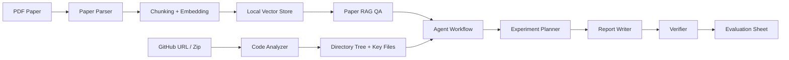

# ResearchFlow-Agent

**基于多工具调用的科研论文阅读与实验复现 AI Agent 系统**  
**A multi-tool AI Agent system for research paper reading, repository analysis, experiment reproduction planning, and evidence-aware reporting**

ResearchFlow-Agent 是一个面向科研论文阅读、代码仓库分析、实验复现规划和证据核验的专业 AI Agent 系统。系统支持上传论文 PDF、构建论文 RAG 知识库、分析 GitHub 代码仓库、生成实验复现计划、生成 Markdown 技术报告，并通过 Verifier 标注证据来源与不确定性。

ResearchFlow-Agent is a professional AI Agent system for research paper reading, code repository analysis, experiment reproduction planning, and evidence verification. It supports PDF paper ingestion, paper-grounded RAG, GitHub repository analysis, experiment planning, Markdown technical report generation, and evidence-aware verification.


上方 GIF 展示论文问答、代码分析、完整 Agent 工作流和实验评测四个核心界面。

The GIF above shows the four core views: paper QA, code analysis, full Agent workflow, and experiment evaluation.

## Project Positioning / 项目定位

ResearchFlow-Agent 不是普通聊天机器人，而是一个围绕“论文 + 代码 + 复现实验”的科研工作流 Agent。它强调可解释过程、可追溯证据、可保存输出和人工可复核的评测记录。

ResearchFlow-Agent is not a generic chatbot. It is a research workflow agent centered on "paper + code + reproducible experiment". It emphasizes inspectable steps, traceable evidence, saved artifacts, and human-reviewable evaluation records.

适用场景：

- 科研论文阅读与方法梳理
- 开源论文代码仓库结构分析
- 实验复现计划设计
- Markdown 项目报告生成
- RAG / Agent / Verifier 模式对比评测

Use cases:

- Research paper reading and method understanding
- Open-source research repository analysis
- Experiment reproduction planning
- Markdown project report generation
- Evaluation of RAG, Agent, and Agent + Verifier workflows

## Core Features / 核心功能

| 模块 | 中文说明 | English Description |
| --- | --- | --- |
| Paper RAG | 解析 PDF、保留页码、切分 chunk、生成 embedding、检索论文证据并回答问题 | Parse PDFs, preserve page numbers, chunk text, embed content, retrieve evidence, and answer paper questions |
| Code Analyzer | 支持 GitHub clone 和 zip 上传，生成目录树，识别 README、依赖文件、训练/推理/模型/数据集/config 文件 | Clone GitHub repositories or extract zip archives, generate a directory tree, and detect key files |
| Experiment Planner | 基于论文和代码分析结果生成实验目标、环境配置、数据准备、训练测试步骤和风险提示 | Generate experiment goals, environment setup, data preparation, training/testing steps, and reproduction risks |
| Report Writer | 生成包含背景、相关工作、方法、系统设计、实验步骤和结果模板的 Markdown 报告 | Generate Markdown reports with background, related work, methods, system design, experiments, and result templates |
| Agent Workflow | 一键执行论文解析、RAG 构建、论文摘要、代码分析、计划生成、报告生成和 Verifier 检查 | Run the full pipeline with one click: paper parsing, RAG indexing, summary, code analysis, planning, reporting, and verification |
| Verifier | 区分论文证据、代码证据、模型推断、缺少证据、人工确认项和潜在幻觉 | Separate paper evidence, code evidence, model inference, missing evidence, human-review items, and possible hallucinations |
| Evaluation | 生成普通 RAG、Agent 分步骤、Agent + Verifier 三种模式的人工评分表，并提供固定 evaluation benchmark | Generate manual evaluation sheets and a fixed evaluation benchmark for ordinary RAG, step-by-step Agent, and Agent + Verifier outputs |

## 当前质量状态 / Current Quality Status

当前版本已经完成可运行 MVP，并通过真实论文 smoke tests 验证了核心链路：

- CLIP 数量题：回答 `400 million`，Top-1 引用为 Page 2，引用片段包含 `400 million (image, text) pairs`。
- ReAct benchmark 题：保留 HotPotQA、Fever、ALFWorld、WebShop 等原始 benchmark 名称。
- RAG formulation 题：区分 RAG-Sequence 和 RAG-Token，并引用 same-document / different-document 证据。
- 单元测试：`42 passed`。

The current version is a runnable MVP validated with real-paper smoke tests:

- CLIP quantity question: answers `400 million`, with Page 2 as the top citation and a direct evidence snippet.
- ReAct benchmark question: preserves HotPotQA, Fever, ALFWorld, and WebShop.
- RAG formulation question: distinguishes RAG-Sequence and RAG-Token with grounded evidence.
- Unit tests: `42 passed`.

## 界面截图 / Screenshots

### 论文问答 / Paper QA

上传论文 PDF 后，系统会解析文本、保留页码、构建本地检索索引，并在回答中显示引用页码与原文片段。

After uploading a PDF, the system extracts text, preserves page numbers, builds a local retrieval index, and returns answers with page-grounded snippets.


### 代码分析 / Code Analysis

支持输入 GitHub 仓库链接或上传 zip 代码包，系统会生成目录树、识别关键文件，并给出代码结构总结。

The code analysis tab accepts a GitHub repository URL or a zip archive, generates a directory tree, detects key files, and summarizes the codebase.


### 完整 Agent 工作流 / Full Agent Workflow

完整工作流会从论文和 GitHub 仓库出发，一键生成论文摘要、代码分析、实验计划、项目报告和 Verifier 结果。

The full workflow starts from a paper PDF and a GitHub repository URL, then generates a paper summary, code analysis, experiment plan, project report, and verifier output.


### 实验评测 / Experiment Evaluation

实验评测模块用于比较普通 RAG、Agent 分步骤、Agent + Verifier 三种模式，输出 Markdown 和 CSV 人工评分表。

The evaluation module compares ordinary RAG, step-by-step Agent, and Agent + Verifier outputs, then exports Markdown and CSV manual scoring sheets.


## System Architecture / 系统架构



系统采用模块化 Python 结构：论文解析、RAG、代码分析、Agent 编排、报告生成、Verifier 和 Evaluation 相互独立，便于测试和扩展。

The system uses a modular Python architecture. Paper parsing, RAG, code analysis, agent orchestration, report generation, verification, and evaluation are separated for testability and extensibility.

## Tech Stack / 技术栈

- Python 3.10+
- Gradio
- PyMuPDF / pdfplumber
- sentence-transformers
- Hybrid dense + lexical retrieval
- Optional cross-encoder reranker
- Local JSON vector store; Chroma / FAISS dependencies are included for extension
- OpenAI-compatible LLM API
- GitPython / subprocess
- Markdown and CSV artifact export
- pytest

## 目录结构 / Project Structure

```text
researchflow-agent/
  README.md
  AGENTS.md
  requirements.txt
  .env.example
  app.py
  config.py
  docs/
    images/
  data/
    uploads/
    vectorstores/
    workspaces/
    outputs/
  src/
    llm/
    paper/
    rag/
    code_analyzer/
    agent/
    report/
    evaluation/
    storage/
    utils/
  tests/
  examples/
```

关键目录说明：

- `src/paper`: PDF 解析与论文文本建模
- `src/rag`: chunk、embedding、本地向量检索和论文问答
- `src/code_analyzer`: GitHub / zip 代码加载、目录树和关键文件识别
- `src/agent`: 实验计划生成和完整 Agent Workflow
- `src/report`: Markdown 项目报告生成
- `src/evaluation`: Verifier 和三模式实验评测表
- `data/outputs`: 生成的计划、报告、评测表和工作流摘要
- `docs/images`: README 截图资源

Key directories:

- `src/paper`: PDF parsing and paper text models
- `src/rag`: chunking, embeddings, local retrieval, and paper QA
- `src/code_analyzer`: GitHub / zip code loading, directory tree generation, and key-file detection
- `src/agent`: experiment planning and complete Agent Workflow
- `src/report`: Markdown project report generation
- `src/evaluation`: verifier and three-mode evaluation sheets
- `data/outputs`: generated plans, reports, evaluation sheets, and workflow summaries
- `docs/images`: README screenshot assets

## Installation / 安装

建议使用独立 conda 环境，不要安装到 `base` 环境。

Use a dedicated conda environment instead of installing dependencies into `base`.

```bash
conda create -n researchflow python=3.11
conda activate researchflow
pip install -r requirements.txt
cp .env.example .env
python app.py
```

运行应用：

Run the application:

```bash
python app.py
```

运行后打开终端输出中的本地 Gradio URL。

After starting the app, open the local Gradio URL printed in the terminal.

## Configuration / 配置

复制 `.env.example` 为 `.env` 后可配置模型和运行参数。

Copy `.env.example` to `.env` and configure model/runtime settings.

```env
OPENAI_API_KEY=your_api_key_here
OPENAI_BASE_URL=https://api.openai.com/v1
OPENAI_MODEL=gpt-4o-mini
EMBEDDING_MODEL=sentence-transformers/all-MiniLM-L6-v2
ALLOW_HASH_EMBEDDING_FALLBACK=true
RERANKER_MODEL=cross-encoder/ms-marco-MiniLM-L-6-v2
ENABLE_CROSS_ENCODER_RERANKER=true
MAX_PAPER_CHUNK_TOKENS=220
CHUNK_OVERLAP_TOKENS=40
TOP_K_RETRIEVAL=8
RERANKER_CANDIDATE_MULTIPLIER=4
GIT_CLONE_TIMEOUT_SECONDS=120
MAX_ZIP_MEMBERS=4000
MAX_ZIP_TOTAL_BYTES=150000000
```

如果没有配置 LLM API key，系统仍可运行离线模板和本地检索流程，但 LLM 总结质量会受限。

If no LLM API key is configured, the system can still run local retrieval and deterministic templates, but LLM-based summaries will be limited.

## Usage / 使用流程

### 1. 论文问答 / Paper QA

1. 打开 **论文问答** Tab。
2. 上传 PDF。
3. 点击 **Parse and Index**。
4. 输入问题并查看带页码引用的回答。

1. Open the **论文问答** tab.
2. Upload a PDF.
3. Click **Parse and Index**.
4. Ask a question and inspect page-grounded citations.

### 2. 代码分析 / Code Analysis

1. 打开 **代码分析** Tab。
2. 输入 GitHub 仓库链接，或上传 zip 代码包。
3. 查看目录树、关键文件表和代码结构总结。

1. Open the **代码分析** tab.
2. Enter a GitHub repository URL or upload a zip archive.
3. Review the directory tree, key files, and codebase summary.

### 3. 完整 Agent 工作流 / Full Agent Workflow

1. 打开 **完整 Agent 工作流** Tab。
2. 上传论文 PDF。
3. 输入 GitHub 仓库链接。
4. 输入任务目标。
5. 点击 **一键运行**。
6. 查看状态日志、论文摘要、实验计划、项目报告和 Verifier 输出。

1. Open the **完整 Agent 工作流** tab.
2. Upload a paper PDF.
3. Enter a GitHub repository URL.
4. Enter the task goal.
5. Click **一键运行**.
6. Review logs, paper summary, experiment plan, project report, and verifier output.

### 4. 实验评测 / Experiment Evaluation

实验评测用于比较三种模式：

1. 普通 RAG 回答
2. Agent 分步骤回答
3. Agent + Verifier 回答

The evaluation workflow compares three modes:

1. Ordinary RAG answer
2. Step-by-step Agent answer
3. Agent + Verifier answer

评测指标：

- 答案完整性
- 引用正确性
- 复现计划可执行性
- 是否存在无依据结论
- 人工评分备注

Evaluation metrics:

- Answer completeness
- Citation correctness
- Reproduction-plan executability
- Unsupported conclusions
- Human scoring notes

输出文件：

- `data/outputs/evaluation-*.md`
- `data/outputs/evaluation-*.csv`

Generated files:

- `data/outputs/evaluation-*.md`
- `data/outputs/evaluation-*.csv`

### 5. Evaluation Benchmark / 固定评测集

项目提供固定 evaluation benchmark，便于重复验证系统在论文问答、证据引用和方法区分任务中的表现：

- `examples/evaluation_benchmark.json`: 三个固定问题，覆盖 CLIP、ReAct、RAG。
- `examples/validation_workflows.md`: 四个推荐验证流程。
- `examples/validation_results.md`: 当前版本的本地验证记录与人工复核建议。
- `docs/technical_overview.md`: 技术概览文档，说明系统架构、核心模块、验证结果和局限性。

The project includes a fixed evaluation benchmark for repeatable validation:

- `examples/evaluation_benchmark.json`: three fixed questions covering CLIP, ReAct, and RAG.
- `examples/validation_workflows.md`: recommended validation workflows.
- `examples/validation_results.md`: current local validation record and human-review checklist.
- `docs/technical_overview.md`: technical overview covering architecture, modules, validation results, and limitations.

在 Gradio 的 **实验评测** Tab 中点击 **Generate Evaluation Benchmark**，可导出：

- `data/outputs/benchmark-evaluation-*.md`
- `data/outputs/benchmark-evaluation-*.csv`

Click **Generate Evaluation Benchmark** in the **实验评测** tab to export Markdown and CSV benchmark sheets.

也可以使用一键脚本生成 evaluation benchmark 结果：

```bash
conda activate researchflow
python scripts/run_evaluation_benchmark.py
```

默认不会调用 LLM，适合本地快速验证和 CI 环境。若需要使用 `.env` 中配置的 OpenAI-compatible API：

```bash
python scripts/run_evaluation_benchmark.py --use-llm
```

The CLI script runs locally by default without LLM calls. Add `--use-llm` to use the configured OpenAI-compatible API.

## Evaluation and Validation / 评测与验证

ResearchFlow-Agent provides manual evaluation templates and fixed validation questions. These artifacts are intended for human-reviewable evaluation, not for replacing manual judgment.

ResearchFlow-Agent 提供人工评测模板和固定验证问题。这些文件用于人工可复核评测，不用于替代人工判断。

Related files:

相关文件：

- `docs/evaluation_report.md`: evaluation goals, modes, metrics, table template, sample result, and limitations.
- `docs/demo_guide.md`: professional walkthrough script for explaining the main workflow.
- `docs/project_summary.md`: concise technical summary and current limitations.
- `docs/technical_overview.md`: architecture, modules, engineering notes, validation status, and roadmap.
- `examples/paper_eval_questions.json`: 5 paper samples with 25 evaluation questions.
- `examples/evaluation_benchmark.json`: compact fixed benchmark for CLIP, ReAct, and RAG questions.

Generate a manual Markdown/CSV evaluation template:

生成手动 Markdown/CSV 评测模板：

```bash
python scripts/run_manual_evaluation_template.py
```

Generate the compact evaluation benchmark result template:

生成紧凑评测 benchmark 结果模板：

```bash
python scripts/run_evaluation_benchmark.py
```

## Security Notes / 安全设计

ResearchFlow-Agent 面向本地科研工作流，但仍做了基础安全限制：

- GitHub clone 只接受标准 `https://github.com/owner/repo` 公共仓库 URL。
- 拒绝 SSH、`git@`、非 GitHub 域名、带 query/fragment 的 URL 和伪造域名。
- clone 使用 shallow clone，并配置超时。
- zip 上传会检查路径穿越、绝对路径、符号链接、文件数量和解压后总体积。
- `.env`、上传文件、向量库、工作区和输出文件默认不提交到 Git。

ResearchFlow-Agent is intended for local research training and includes basic safety controls:

- GitHub cloning accepts only public HTTPS URLs in the `https://github.com/owner/repo` form.
- SSH, `git@`, non-GitHub hosts, query/fragment URLs, and spoofed domains are rejected.
- Cloning uses shallow clone with timeout.
- Zip uploads are checked for path traversal, absolute paths, symlinks, member count, and total extracted size.
- `.env`, uploads, vector stores, workspaces, and outputs are ignored by Git by default.

## Verifier Design / Verifier 设计

Verifier 不声称生成内容 100% 正确。它的作用是帮助用户区分证据、推断和风险。

The verifier does not claim that generated content is 100% correct. Its purpose is to separate evidence, inference, and risk.

Verifier 输出七类信息：

1. 来自论文的内容
2. 来自代码仓库的内容
3. 模型推断的内容
4. 缺少证据的内容
5. 需要人工确认的内容
6. 可能存在幻觉的内容
7. 改进建议

The verifier outputs seven categories:

1. Content from the paper
2. Content from the code repository
3. Model-inferred content
4. Content with missing evidence
5. Items requiring human confirmation
6. Possible hallucinations
7. Improvement suggestions

## Known Limitations / 已知局限

- ResearchFlow-Agent does not automatically run real training experiments.
- ResearchFlow-Agent 不会自动运行真实训练实验。
- Verifier provides evidence attribution and uncertainty classification, but it does not guarantee factual correctness.
- Verifier 提供证据归因和不确定性分类，但不保证事实正确。
- Evaluation artifacts are designed for human review and require manual scoring.
- 评测文件面向人工复核，仍需要人工评分。
- PDF page numbers come from parser page order and should be checked against the original PDF viewer when exact page mapping matters.
- PDF 页码来自解析器页序；需要严格页码映射时，应与原 PDF 阅读器核对。
- If hashing fallback is used, retrieval quality may be weaker than real semantic embeddings.
- 如果使用 hashing fallback，检索质量可能弱于真实语义 embedding。
- Chroma / FAISS are available as extension directions, while the current main implementation uses a local JSON vector store.
- Chroma / FAISS 是扩展方向，当前主实现仍使用本地 JSON vector store。

## Testing / 测试

```bash
conda activate researchflow
pytest tests
```

项目包含 GitHub Actions CI：`.github/workflows/tests.yml` 会在 push 和 pull request 时安装依赖并运行测试。

The repository includes GitHub Actions CI in `.github/workflows/tests.yml`, which installs dependencies and runs tests on push and pull request events.

当前测试覆盖：

- PDF 解析错误处理
- chunk 切分
- embedding fallback 和本地向量检索
- hybrid retrieval、cross-encoder reranker 和 query-aware 引用片段
- 代码仓库分析
- GitHub URL 与 zip 上传安全边界
- 实验计划与报告生成
- 完整 Agent Workflow 成功与失败路径
- Verifier 证据归因与不确定性输出
- 实验评测表与 evaluation benchmark Markdown / CSV 导出

Current tests cover:

- PDF parser error handling
- Chunking
- Embedding fallback and local vector retrieval
- Hybrid retrieval, cross-encoder reranking, and query-aware citation snippets
- Code repository analysis
- GitHub URL and zip-upload security boundaries
- Experiment planning and report writing
- Full Agent Workflow success and failure paths
- Verifier evidence attribution and uncertainty reporting
- Evaluation and evaluation benchmark Markdown / CSV export

## 当前状态 / Current Status

ResearchFlow-Agent 已实现一个可运行的科研工作流 MVP：论文 RAG、代码分析、实验计划、报告生成、Verifier、实验评测和 Gradio UI 均已具备基础功能。

ResearchFlow-Agent currently provides a runnable research workflow MVP: paper RAG, code analysis, experiment planning, report writing, verifier, evaluation sheets, and Gradio UI are implemented.

## Roadmap / 后续计划

- SQLite 会话历史与项目级持久化
- 更严格的 citation-level fact checking
- 更完整的 Chroma / FAISS backend adapter
- 自动读取论文标题、作者、摘要和章节结构
- 评测结果可视化
- 自动运行 benchmark 并生成汇总图表

Planned improvements:

- SQLite session history and project-level persistence
- Stronger citation-level fact checking
- Complete Chroma / FAISS backend adapters
- Automatic paper title, author, abstract, and section extraction
- Evaluation result visualization
- Automatic benchmark execution with summary charts

## 声明 / Notes

本项目用于科研工作流辅助，不替代真实科研判断。论文事实、实验指标、复现结果和报告结论都应由使用者进行人工复核。

This project is intended to support research workflows. It does not replace human research judgment. Paper facts, experiment metrics, reproduction results, and report conclusions should be manually verified.
