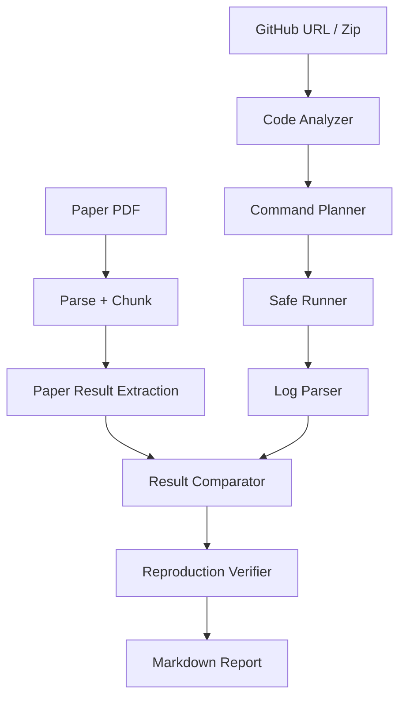

# Reproduction Workflow

# 论文复现工作流

## Purpose / 目的

The Reproduction workflow helps users move from paper reading and repository inspection toward a human-reviewable reproduction attempt. It extracts paper results, analyzes code entry points, plans commands, optionally runs low-risk commands, parses logs, compares metrics, and generates a Markdown report.

论文复现工作流帮助用户从论文阅读和仓库检查进入可人工复核的复现尝试。它会抽取论文结果、分析代码入口、规划命令、可选执行低风险命令、解析日志、对比指标并生成 Markdown 报告。

## Inputs / 输入

The Gradio tab accepts:

Gradio Tab 接受：

1. Paper PDF
2. GitHub repository URL or zip archive
3. Execution mode
   - `dry-run only`
   - `run safe commands`
4. Timeout seconds
5. User notes, such as dataset path or checkpoint path

## Outputs / 输出

The workflow returns:

工作流输出：

1. Paper result extraction
2. Code entry analysis
3. Candidate reproduction commands
4. Run log summary
5. Parsed metrics
6. Paper result vs reproduced result comparison
7. Verifier checks
8. Markdown reproduction report path

## Step-by-Step Flow / 分步流程



## Paper Result Extraction / 论文结果抽取

The extractor scans result-related chunks for terms such as:

抽取器会扫描包含以下关键词的论文片段：

- table
- result
- accuracy
- performance
- evaluation
- experiment
- baseline
- ablation
- comparison

It then extracts common metrics such as `accuracy`, `precision`, `recall`, `F1`, `BLEU`, `ROUGE`, `Dice`, `IoU`, `mIoU`, and `loss`.

系统会尝试抽取 `accuracy`、`precision`、`recall`、`F1`、`BLEU`、`ROUGE`、`Dice`、`IoU`、`mIoU` 和 `loss` 等常见指标。

If evidence is weak, the output explicitly marks `missing evidence`, `uncertain`, or `requires manual check`.

如果证据不足，输出会明确标注 `missing evidence`、`uncertain` 或 `requires manual check`。

## Command Planning / 命令规划

Candidate commands are generated from detected entry files and config files. Examples:

候选命令来自识别到的入口文件和配置文件。例如：

```bash
pip install -r requirements.txt
python train.py --config configs/default.yaml
python evaluate.py --config configs/default.yaml
```

These commands are not automatically trusted. Each command receives a risk level and must be reviewed before execution.

这些命令不会被自动信任。每条命令都有风险等级，执行前需要人工复核。

## Execution / 执行

Default mode:

默认模式：

```text
dry-run only
```

Dry-run mode generates command records without executing repository code. The `run safe commands` mode only executes commands classified as `safe`.

dry-run 模式只生成命令记录，不执行仓库代码。`run safe commands` 模式只执行被分类为 `safe` 的命令。

## Report / 报告

The workflow saves:

工作流保存：

```text
data/outputs/reproduction_report.md
```

The report includes environment files, planned commands, execution records, parsed metrics, comparison results, verifier checks, and follow-up recommendations.

报告包含环境文件、规划命令、执行记录、解析指标、对比结果、Verifier 检查和后续建议。

## Limitations / 局限性

- The system does not automatically complete full training runs.
- 系统不会自动完成完整训练。
- Metrics parsed from logs must be checked against the original logs.
- 从日志解析出的指标需要与原始日志核对。
- Paper-result extraction is heuristic and may miss table-only or figure-only results.
- 论文结果抽取是启发式方法，可能漏掉只存在于表格或图中的结果。
- Reproduction commands require human review before real use.
- 复现命令在真实使用前需要人工复核。
- Verifier helps classify evidence and uncertainty, but it does not guarantee factual correctness.
- Verifier 辅助分类证据和不确定性，但不保证事实完全正确。
