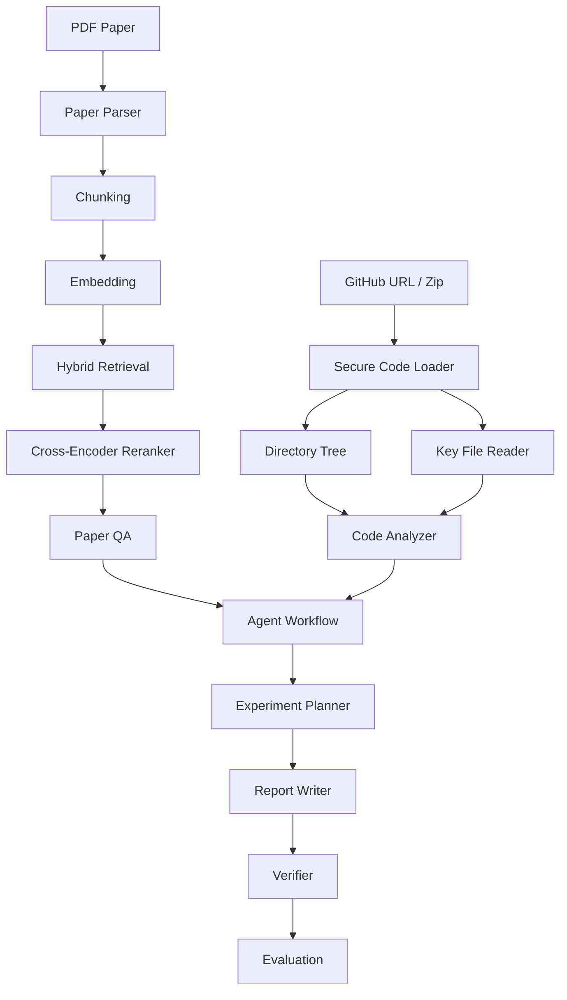

# ResearchFlow-Agent Project Showcase

## 1. 项目简介 / Overview

ResearchFlow-Agent 是一个面向本科生科研训练的 AI Agent 系统，围绕“论文阅读、代码理解、实验复现、证据核验”构建完整工作流。用户上传论文 PDF，输入 GitHub 仓库链接或上传代码压缩包后，系统可以完成论文 RAG 问答、代码结构分析、实验复现计划生成、项目报告生成和 Verifier 风险检查。

ResearchFlow-Agent is an AI Agent system for undergraduate research training. It connects paper reading, repository analysis, experiment reproduction planning, report writing, and evidence-aware verification into a single workflow.

## 2. 目标用户 / Target Users

- 正在做 AI 课程设计或科研训练的本科生
- 需要快速理解论文和代码仓库的科研新手
- 准备项目经历、保研材料、作品集或面试展示的学生
- 希望比较 RAG、Agent、Verifier 三种模式的学习者

## 3. 系统架构 / Architecture



核心设计原则：

- 模块化：论文、RAG、代码分析、Agent、报告、Verifier、Evaluation 分层实现。
- 可追溯：论文回答显示页码、chunk id 和原文片段。
- 可复核：Verifier 不假装绝对正确，而是标出证据、推断、缺失依据和人工确认项。
- 可运行：Gradio Web UI、测试、示例、CI 和 demo benchmark 均已提供。

## 4. 核心功能 / Key Features

| Feature | What It Does | Why It Matters |
| --- | --- | --- |
| Paper RAG | Parses PDF, chunks text, embeds content, retrieves evidence, answers with citations | Makes paper QA inspectable and source-grounded |
| Hybrid Retrieval | Combines dense similarity, lexical/BM25-style ranking, and intent boosts | Improves factual recall for numeric, benchmark, and method-definition questions |
| Cross-Encoder Reranker | Reranks candidate chunks before LLM answering | Improves top evidence quality |
| Code Analyzer | Clones GitHub repos or extracts zip archives, builds tree, reads key files | Turns codebases into reproducible experiment context |
| Experiment Planner | Generates goals, environment, data, train/test steps, metrics, risks | Helps students move from reading to reproduction |
| Report Writer | Produces Markdown project reports | Makes outputs portfolio-ready |
| Verifier | Separates paper evidence, code evidence, model inference, missing evidence, and possible hallucinations | Reduces overclaiming |
| Evaluation | Exports single-question sheets and fixed demo benchmark CSV/Markdown | Makes comparison between modes repeatable |

## 5. 工程难点 / Engineering Challenges

### 5.1 Grounded RAG

早期版本容易出现“答案正确但引用片段不够直接”的问题。当前版本通过以下方式改进：

- hybrid retrieval 先召回更多候选片段；
- cross-encoder reranker 提升最相关证据排序；
- query-aware evidence excerpt 只展示与问题最相关的句子；
- LLM 回答必须包含 `[S#]` 来源编号，否则回退到抽取式证据。

### 5.2 Codebase Understanding

Code Analyzer 不只生成目录树，还会读取 README、requirements、train.py、model.py、dataset.py、config 等关键文件内容，并在总结中明确哪些信息来自代码、哪些需要人工确认。

### 5.3 Security

项目面向本地演示，但仍需要避免明显风险：

- GitHub URL 只允许 `https://github.com/owner/repo`。
- 拒绝 SSH、`git@`、伪造域名、query/fragment。
- zip 解压检查路径穿越、绝对路径、符号链接、成员数量和解压体积。
- `.env`、上传文件、向量库、工作区和输出默认不进 Git。

## 6. Demo Benchmark

固定 benchmark 位于 `examples/evaluation_benchmark.json`，包含三类代表性问题：

| Case | Paper | Question Focus | Expected Evidence |
| --- | --- | --- | --- |
| `clip-data-scale` | CLIP | 数量题：训练数据规模 | `400 million (image, text) pairs` |
| `react-benchmarks` | ReAct | benchmark 枚举 | HotPotQA, Fever, ALFWorld, WebShop |
| `rag-formulations` | RAG | 方法定义区分 | RAG-Sequence vs RAG-Token |

运行方式：

```bash
conda activate researchflow
python scripts/run_demo_benchmark.py
```

如需使用 LLM：

```bash
python scripts/run_demo_benchmark.py --use-llm
```

输出文件：

- `data/outputs/demo-benchmark-results-*.json`
- `data/outputs/demo-benchmark-results-*.md`

## 7. 当前验证结果 / Current Validation

- Unit tests: `40 passed`
- App construction: `app.build_app()` returns `Blocks`
- Demo benchmark template: exports Markdown and CSV
- Real-paper smoke tests:
  - CLIP quantity question returned `400 million` with Page 2 direct evidence.
  - ReAct benchmark question preserved HotPotQA, Fever, ALFWorld, and WebShop.
  - RAG formulation question distinguished RAG-Sequence and RAG-Token.

## 8. 项目亮点 / Portfolio Highlights

- 不是单纯聊天机器人，而是多工具科研 Agent workflow。
- 有真实论文和真实仓库场景，而不是 toy demo。
- RAG 结果包含页码、chunk id 和原文片段。
- Verifier 主动暴露不确定性，避免“强行自信”。
- 提供测试、CI、README、截图、demo benchmark 和可保存输出。

## 9. 局限性 / Limitations

- PDF 页码来自解析器页序，仍建议与 PDF 阅读器人工核对。
- 复现实验计划不等于已经真实训练成功，数据集、权重、硬件和指标需要人工验证。
- Verifier 是证据归因和风险提示模块，不是形式化事实证明器。
- 当前 Evaluation 以人工评分表和固定 benchmark 为主，尚未实现完全自动评分。

## 10. 下一步 / Next Steps

- 自动运行 benchmark 并汇总多次结果。
- 增加 SQLite 会话历史。
- 增强 citation-level factuality check。
- 增加图表化评测结果。
- 补充更多论文类型，如 CV、NLP、Agent、Multimodal 和 RAG。
