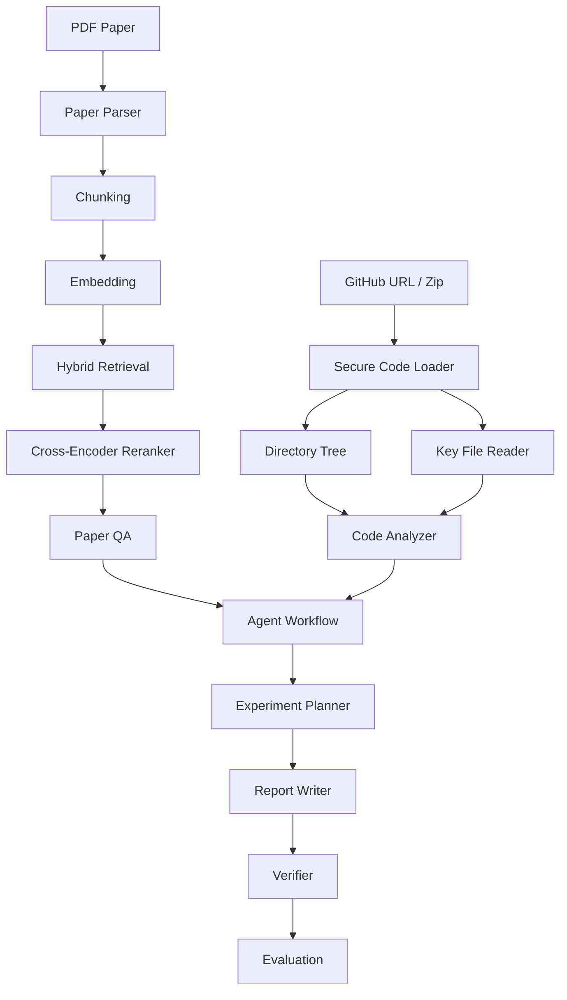

# ResearchFlow-Agent Technical Overview

# ResearchFlow-Agent 技术概览

## 1. Overview / 概述

ResearchFlow-Agent is a professional AI Agent system for research paper reading, repository analysis, experiment reproduction planning, report generation, and evidence-aware verification.

ResearchFlow-Agent 是一个专业 AI Agent 系统，用于科研论文阅读、代码仓库分析、实验复现规划、报告生成和证据感知核验。

The system accepts paper PDFs and code repositories as inputs, builds a paper-grounded RAG index, analyzes key code files, generates reproduction plans, writes Markdown reports, and separates evidence from model inference through a verifier module.

系统以论文 PDF 和代码仓库作为输入，构建基于论文内容的 RAG 索引，分析关键代码文件，生成实验复现计划，输出 Markdown 报告，并通过 Verifier 模块区分证据与模型推断。

## 2. Target Users / 目标用户

- Researchers and engineers who need to inspect papers and code repositories together.
- 需要同时检查论文和代码仓库的研究人员与工程人员。
- Developers building reproducible experiment workflows.
- 构建可复现实验流程的开发者。
- Teams that need traceable answers, saved reports, and reviewable evaluation records.
- 需要可追溯回答、可保存报告和可复核评测记录的团队。

## 3. Architecture / 系统架构



Design principles:

设计原则：

- Modular components for paper parsing, RAG, code analysis, agent workflow, reporting, verification, and evaluation.
- 论文解析、RAG、代码分析、Agent 工作流、报告生成、核验和评测均采用模块化组件。
- Traceable outputs with page numbers, chunk identifiers, file paths, and evidence snippets.
- 输出包含页码、chunk id、文件路径和证据片段，便于追溯。
- Conservative verification that reports uncertainty instead of claiming perfect correctness.
- Verifier 以保守方式报告不确定性，而不是声称完全正确。
- Local-first execution with optional OpenAI-compatible LLM integration.
- 优先本地运行，并支持可选的 OpenAI-compatible LLM 接入。

## 4. Key Modules / 核心模块

| Module | English Description | 中文说明 |
| --- | --- | --- |
| Paper RAG | Parses PDFs, chunks text, builds embeddings, retrieves evidence, and answers with citations. | 解析 PDF、切分文本、构建 embedding、检索证据，并生成带引用的回答。 |
| Hybrid Retrieval | Combines dense similarity, lexical ranking, and task-specific boosts. | 结合 dense similarity、词法排序和任务相关 boost。 |
| Cross-Encoder Reranker | Reranks candidate chunks before answer generation. | 在生成回答前重排候选 chunk。 |
| Code Analyzer | Loads GitHub repositories or zip archives, generates a tree, and reads key files. | 加载 GitHub 仓库或 zip 包，生成目录树并读取关键文件。 |
| Experiment Planner | Produces environment, data, training, testing, metric, and risk plans. | 生成环境、数据、训练、测试、指标和风险计划。 |
| Report Writer | Generates Markdown technical reports. | 生成 Markdown 技术报告。 |
| Verifier | Separates paper evidence, code evidence, inference, missing evidence, and possible hallucination. | 区分论文证据、代码证据、模型推断、缺少证据和潜在幻觉。 |
| Evaluation | Exports single-question evaluation sheets and fixed benchmark files. | 导出单题评测表和固定 benchmark 文件。 |

## 5. Engineering Notes / 工程说明

### 5.1 Grounded RAG / 有依据的 RAG

The RAG pipeline retrieves candidate chunks with hybrid search, reranks them with a cross-encoder when available, extracts query-focused evidence sentences, and asks the LLM to cite source identifiers such as `[S1]`.

RAG 流程先通过 hybrid search 召回候选 chunk，在可用时使用 cross-encoder reranker 重排，再抽取与问题相关的证据句，并要求 LLM 使用 `[S1]` 等来源编号进行引用。

If the LLM response does not contain valid source identifiers, the system falls back to extractive evidence instead of accepting an unsupported answer.

如果 LLM 回答没有包含有效来源编号，系统会回退到抽取式证据，而不是直接接受无依据回答。

### 5.2 Code Analysis / 代码分析

The code analyzer reads README files, dependency files, training scripts, inference scripts, model definitions, dataset files, notebooks, and configuration files when they are present.

代码分析模块会在存在时读取 README、依赖文件、训练脚本、推理脚本、模型定义、数据集文件、notebook 和配置文件。

The local fallback summary explicitly states which files were read and which information remains unknown.

本地 fallback 总结会明确说明哪些文件已读取，哪些信息仍然未知。

### 5.3 Security / 安全限制

The repository loader only accepts public HTTPS GitHub URLs in the `https://github.com/owner/repo` form.

仓库加载器只接受 `https://github.com/owner/repo` 形式的公开 HTTPS GitHub URL。

Zip extraction checks for path traversal, absolute paths, symlinks, excessive member count, and excessive extracted size.

zip 解压会检查路径穿越、绝对路径、符号链接、过多文件数量和过大解压体积。

## 6. Evaluation Benchmark / 评测 Benchmark

The fixed benchmark is stored in `examples/evaluation_benchmark.json`.

固定 benchmark 位于 `examples/evaluation_benchmark.json`。

| Case | Paper | Question Focus | Expected Evidence |
| --- | --- | --- | --- |
| `clip-data-scale` | CLIP | Training data scale | `400 million (image, text) pairs` |
| `react-benchmarks` | ReAct | Benchmark enumeration | HotPotQA, Fever, ALFWorld, WebShop |
| `rag-formulations` | RAG | Method formulation distinction | RAG-Sequence and RAG-Token |

Run the benchmark script:

运行 benchmark 脚本：

```bash
conda activate researchflow
python scripts/run_evaluation_benchmark.py
```

Use the configured LLM only when needed:

仅在需要时使用已配置的 LLM：

```bash
python scripts/run_evaluation_benchmark.py --use-llm
```

Generated files:

生成文件：

- `data/outputs/evaluation-benchmark-results-*.json`
- `data/outputs/evaluation-benchmark-results-*.md`

## 7. Current Validation / 当前验证

- Unit tests: `42 passed`
- 单元测试：`42 passed`
- App construction: `app.build_app()` returns `Blocks`
- 应用构建：`app.build_app()` 返回 `Blocks`
- Evaluation benchmark template exports Markdown and CSV.
- Evaluation benchmark 模板可导出 Markdown 和 CSV。
- Real-paper smoke tests cover CLIP, ReAct, and RAG questions.
- 真实论文 smoke tests 覆盖 CLIP、ReAct 和 RAG 问题。

## 8. Limitations / 局限性

- PDF page numbers come from parser page order and should be checked against the original PDF viewer when exact publication page numbers matter.
- PDF 页码来自解析器页序；如果需要严格出版页码，应与原 PDF 阅读器核对。
- A generated reproduction plan is not a completed experiment run. Datasets, checkpoints, hardware, and metrics still require manual verification.
- 生成的复现计划不等于已经完成实验运行；数据集、checkpoint、硬件和指标仍需人工验证。
- The verifier provides evidence attribution and risk hints, not formal proof of factual correctness.
- Verifier 提供证据归因和风险提示，不是事实正确性的形式化证明。
- Evaluation currently uses fixed benchmark cases and human-reviewable scoring artifacts rather than fully automatic judging.
- 当前评测使用固定 benchmark 和人工可复核评分文件，而不是完全自动评分。

## 9. Roadmap / 后续计划

- Add SQLite session history.
- 增加 SQLite 会话历史。
- Add stronger citation-level factuality checks.
- 增强 citation-level 事实核验。
- Add Chroma / FAISS backend adapters.
- 增加 Chroma / FAISS 后端适配。
- Add evaluation result visualization.
- 增加评测结果可视化。
- Add more benchmark papers across CV, NLP, Agent, Multimodal, and RAG.
- 补充更多 CV、NLP、Agent、Multimodal 和 RAG 论文 benchmark。
